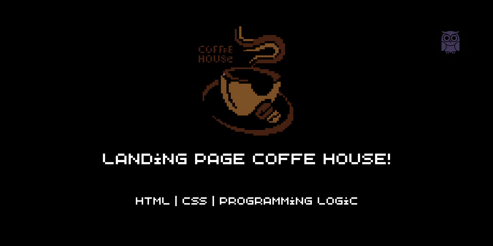
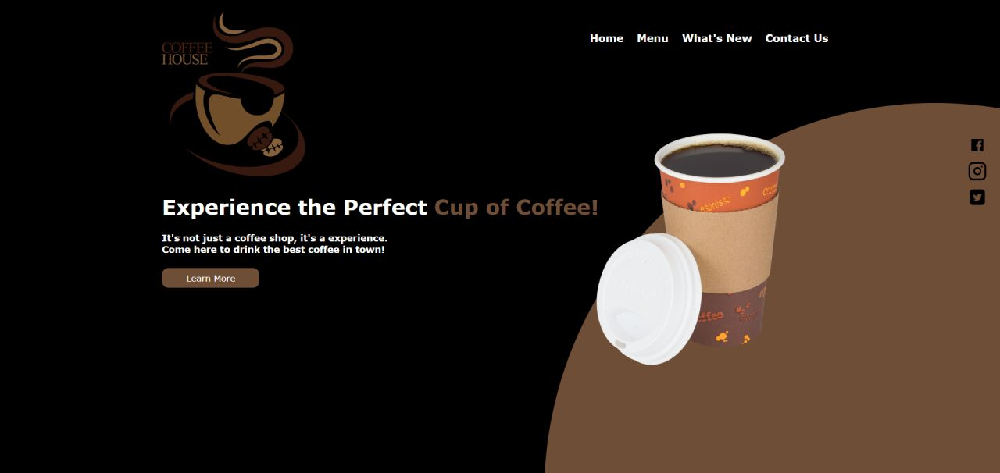

# ☕ Coffee House - Landing Page

<p align="center">
  
</p>

## 📖 Sobre o projeto

**Coffee House** é uma landing page desenvolvida para uma cafeteria fictícia com o objetivo de praticar conceitos fundamentais de desenvolvimento Front-End utilizando **HTML** e **CSS**.

Este projeto foi criado como parte dos meus estudos para aprimorar habilidades na construção de interfaces modernas, organização de layout e estilização de páginas web.

---

## 🚀 Tecnologias utilizadas

- HTML5
- CSS3

---

## ✨ Funcionalidades

- Layout moderno
- Navegação simples
- Design inspirado em cafeterias
- Botões de chamada para ação (CTA)
- Ícones para redes sociais
- Estrutura organizada e de fácil manutenção

---

## 📸 Preview

<p align="center">
  
</p>

---

## 💻 Como executar

1. Clone este repositório

```bash
git clone https://github.com/eduardomarcelo628-beep/Coffee-House---Landing-Page.git
```

2. Abra a pasta do projeto.

3. Execute o arquivo **index.html** em seu navegador.

Ou utilize a extensão **Live Server** do Visual Studio Code.

---

## 🎯 Objetivos do projeto

Durante o desenvolvimento deste projeto foram praticados:

- Estruturação semântica em HTML
- Posicionamento de elementos
- Organização de arquivos
- Estilização com CSS
- Escolha de paleta de cores
- Criação de uma Landing Page

---

## 📚 Aprendizados

Este projeto foi importante para reforçar conhecimentos sobre construção de layouts e boas práticas de organização em HTML e CSS.

Além disso, proporcionou experiência na criação de interfaces visualmente agradáveis e focadas na experiência do usuário.

---

## 🔨 Melhorias futuras

- Tornar totalmente responsivo
- Adicionar animações com CSS
- Implementar JavaScript para maior interatividade
- Criar seção de produtos
- Criar seção de avaliações
- Adicionar formulário de contato funcional

---

## 👨🏽‍💻 Autor

**Marcelo Eduardo**

Estudante de Análise e Desenvolvimento de Sistemas, desenvolvendo projetos para aprimorar meus conhecimentos em programação e construir um portfólio consistente.

🌐 GitHub: [Meu GitHub](https://github.com/eduardomarcelo628-beep)

💼 LinkedIn: [Meu LinkedIn](https://www.linkedin.com/in/marcelo-eduardo-a03978246/)

